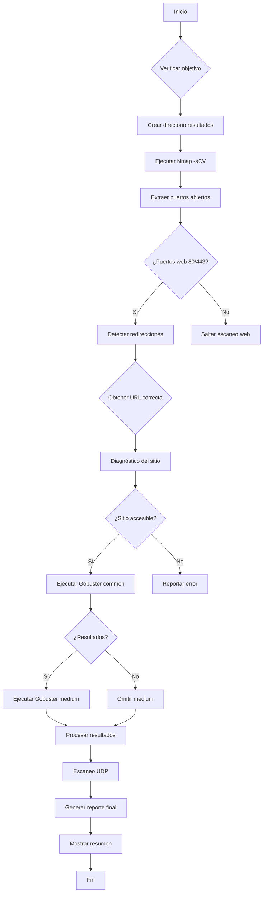

# 🚀 AutoRecon - Script de Automatización de Escaneo Inicial

[](https://github.com)
[](https://github.com)
[](https://github.com)

📋 Descripción

AutoRecon es un script avanzado de automatización en Bash diseñado para realizar escaneos iniciales rápidos y eficientes durante pruebas de penetración. Combina múltiples herramientas de reconocimiento en una sola ejecución, con manejo inteligente de redirecciones web y filtrado de información relevante.

---

## ✨ Características Principales

### Escaneo Inteligente Nmap
- Escaneo completo de puertos con `-sCV` (scripts + versiones)
- Detección automática de servicios y versiones
- Extracción precisa de puertos abiertos
- Output filtrado y organizado

### Fuzzing Web con Gobuster
- Directorio fuzzing con diccionarios profesionales:
  - `common.txt` (diccionario básico)
  - `DirBuster-2007_directory-list-2.3-medium.txt` (diccionario completo)
- Búsqueda de extensiones comunes
- Filtrado inteligente de resultados
- Diagnóstico previo del sitio web

### Reportes Organizados
- Output con colores para mejor legibilidad
- Información filtrada y relevante
- Reporte completo en formato texto
- Archivos organizados por timestamp
- Resumen ejecutivo al finalizar

---

## 🛠️ Requisitos del Sistema

### Herramientas Necesarias

```bash
# Herramientas esenciales
sudo apt update
sudo apt install -y nmap gobuster seclists dirb curl

# Verificar instalación
nmap --version
gobuster version
ls /usr/share/seclists/  # Debe mostrar contenido
```

### Permisos

```bash
# Dar permisos de ejecución al script
chmod +x scan_initial_v2.sh

# Opcional: Mover a PATH del sistema
sudo cp scan_initial_v2.sh /usr/local/bin/autorecon
```

---

## 🚀 Uso Básico

### Sintaxis

```bash
./scan_initial_v2.sh <TARGET_IP_OR_DOMAIN>
```

### Ejemplos

```bash
# Escanear una dirección IP
./scan_initial_v2.sh 192.168.1.100

# Escanear un dominio
./scan_initial_v2.sh target.com

# Escanear con output detallado
./scan_initial_v2.sh 10.0.0.50
```

---

## 📁 Estructura de Archivos Generados

Cada ejecución crea un directorio con el siguiente formato:

```
scan_results_<TARGET>_<TIMESTAMP>/
├── full_report.txt              # Reporte completo consolidado
├── nmap_full_scan.txt          # Resultados brutos de Nmap
├── nmap_filtered.txt           # Nmap filtrado (información relevante)
├── gobuster_common_<PORT>.txt  # Resultados Gobuster (common)
├── gobuster_medium_<PORT>.txt  # Resultados Gobuster (medium)
├── gobuster_filtered_<PORT>.txt # Resultados Gobuster filtrados
├── gobuster_execution.log      # Logs de ejecución de Gobuster
└── nmap_udp_scan.txt          # Resultados de escaneo UDP
```

---

## 🔄 Flujo de Ejecución


---

## 🔧 Configuración de Diccionarios

### Rutas Predeterminadas (Kali/Parrot)

```bash
# Common dictionary
/usr/share/wordlists/dirb/common.txt

# Medium dictionary  
/usr/share/seclists/Discovery/Web-Content/DirBuster-2007_directory-list-2.3-medium.txt
```

### Verificar/Actualizar Rutas

```bash
# Verificar existencia
ls -la /usr/share/wordlists/dirb/common.txt
ls -la /usr/share/seclists/Discovery/Web-Content/

# Buscar alternativas
find /usr/share -name "common.txt" 2>/dev/null
find /usr/share -name "*medium*.txt" 2>/dev/null

# Instalar si faltan
sudo apt install seclists dirb
```

---

## 🎯 Características Avanzadas

### 1. Manejo Inteligente de URLs

```bash
# El script prioriza en este orden:
1. Redirección HTTP/HTTPS detectada
3. URL basada en IP (http:// o https://)
```

### 2. Diagnóstico Automático
- Verifica conectividad antes de escanear
- Detecta códigos HTTP de respuesta
- Valida accesibilidad del sitio
- Reporta problemas de conexión

### 3. Filtrado de Resultados

```bash
# Solo muestra códigos relevantes
Status: 200, 301, 302, 307, 403

# Filtra extensiones importantes
.php, .txt, .sql, .log, .bak, .config, .ini

# Busca palabras clave sensibles
admin, login, backup, config, test, debug, api
```
---

## 📊 Output de Ejemplo

```
$ ./autorecon.sh realgob.dl

[+] Iniciando escaneo inicial contra: realgob.dl
[+] Directorio de resultados: scan_results_realgob_dl_20250206_183015

[*] Iniciando escaneo Nmap (sCV)...
=============================================
[*] Ejecutando escaneo completo...
[+] Extraendo información relevante...
[+] Escaneo Nmap completado
[*] Puertos TCP abiertos encontrados:
22,80,3306

[*] Servicios principales detectados:
  22/tcp - ssh
      Versión: OpenSSH 9.6p1 Ubuntu 3ubuntu13.5 (Ubuntu Linux; protocol 2.0)
  80/tcp - http
      Versión: Apache httpd 2.4.58
  3306/tcp - mysql
      Versión: MariaDB 5.5.5-10.11.8

[*] Analizando servicios web...
[+] Servicio HTTP detectado (puerto 80)

[+] Servicio web detectado en: http://realgob.dl
[*] URL final para escaneo: http://realgob.dl
[*] Usando direcciones exactas de diccionarios
[+] Diccionario common: /usr/share/wordlists/dirb/common.txt
[+] Diccionario medium: /home/kali/Seclist-Dicctionaries/Discovery/Web-Content/DirBuster-2007_directory-list-2.3-medium.txt

[*] Realizando diagnóstico rápido...
[*] Código HTTP: 200
[+] Sitio accesible, procediendo con escaneo...

[*] Ejecutando Gobuster (common)...
[*] Comando: gobuster dir -u "http://realgob.dl" -w "/usr/share/wordlists/dirb/common.txt" -t 20 -x php,txt,html,js,json 
[*] Iniciando... (puede tardar varios minutos)
2026/02/06 18:30:16 Starting gobuster in directory enumeration mode
===============================================================
/admin                (Status: 200) [Size: 5243]
/login                (Status: 200) [Size: 3120] 
/assets               (Status: 301) [Size: 321] [--> http://realgob.dl/assets/]
/uploads              (Status: 301) [Size: 322] [--> http://realgob.dl/uploads/]
/config.php           (Status: 200) [Size: 142]
/robots.txt           (Status: 200) [Size: 45]
/index.php            (Status: 200) [Size: 8932]
===============================================================
2026/02/06 18:30:22 Finished
[✓] Gobuster (common) completado

[*] Continuando con diccionario medium...
[*] Ejecutando Gobuster (medium)...
[*] Comando: gobuster dir -u "http://realgob.dl" -w "/home/kali/Seclist-Dicctionaries/Discovery/Web-Content/DirBuster-2007_directory-list-2.3-medium.txt" -t 20 -x php,txt,html,js,json,zip,bak,old,backup,sql,config,env 
[*] Iniciando... (puede tardar varios minutos)
2026/02/06 18:30:22 Starting gobuster in directory enumeration mode
===============================================================
/backup               (Status: 301) [Size: 322] [--> http://realgob.dl/backup/]
/database_backup.sql  (Status: 200) [Size: 14205]
/.env                 (Status: 200) [Size: 87]
/config.old.php       (Status: 200) [Size: 245]
/test_api.php         (Status: 200) [Size: 134]
/debug.php            (Status: 200) [Size: 210]
/wp-admin             (Status: 301) [Size: 325] [--> http://realgob.dl/wp-admin/]
/phpmyadmin           (Status: 301) [Size: 327] [--> http://realgob.dl/phpmyadmin/]
/server-status        (Status: 403) [Size: 284]
===============================================================
2026/02/06 18:34:15 Finished
[✓] Gobuster (medium) completado

[+] Procesando resultados...
[+] Escaneo Gobuster completado
[*] Resultados encontrados:
  Common: 7 resultados
  Medium: 10 resultados

[*] Algunos resultados common:
/admin                (Status: 200) [Size: 5243]
/login                (Status: 200) [Size: 3120]
/assets               (Status: 301) [Size: 321]
/config.php           (Status: 200) [Size: 142]

[*] Ejecutando escaneo UDP rápido...
=============================================
[+] Puertos UDP abiertos encontrados:
  161/udp - snmp

[+] Generando reporte final...
=============================================
[+] ESCANEO COMPLETADO
=============================================
[*] Resumen del escaneo:
  - Objetivo: realgob.dl
  - Puertos TCP abiertos: 22,80,3306
  - Servicio web: http://realgob.dl
  - Resultados Gobuster: Common=7, Medium=10
  - Reporte completo: scan_results_realgob_dl_20250206_183015/full_report.txt

[*] Archivos generados:
  - full_report.txt
  - gobuster_common_80.txt
  - gobuster_execution.log
  - gobuster_filtered_80.txt
  - gobuster_medium_80.txt
  - nmap_filtered.txt
  - nmap_full_scan.txt
  - nmap_udp_scan.txt

[+] Para ver el reporte completo:
    cat "scan_results_realgob_dl_20250206_183015/full_report.txt"

[+] Para ver logs de ejecución:
    cat "scan_results_realgob_dl_20250206_183015/gobuster_execution.log"

[✓] ¡Listo para análisis manual!
```

---

## ⚠️ Solución de Problemas

### Problemas Comunes

| Problema | Causa | Solución |
|----------|-------|----------|
| Diccionarios no encontrados | Rutas incorrectas | Verificar/editar rutas en script |
| Gobuster no encuentra resultados | Sitio no accesible | Verificar diagnóstico web |
| URL con caracteres extraños | Output contaminado | El script limpia automáticamente |
| Timeout en escaneos | Red lenta/objetivo lento | Aumentar timeout en script |

### Comandos de Diagnóstico

```bash
# Verificar funcionamiento básico
curl -v http://objetivo.com
nmap -p 80,443 objetivo.com
gobuster dir -u http://objetivo.com -w /usr/share/wordlists/dirb/common.txt -t 5

# Verificar logs del script
cat scan_results_*/gobuster_execution.log
cat scan_results_*/full_report.txt
```

---

## 🤝 Contribuciones

Las contribuciones son bienvenidas. Por favor:

1. Fork el repositorio
2. Crea una rama para tu feature (`git checkout -b feature/AmazingFeature`)
3. Commit tus cambios (`git commit -m 'Add some AmazingFeature'`)
4. Push a la rama (`git push origin feature/AmazingFeature`)
5. Abre un Pull Request

---

## ⚠️ Aviso Legal

**ADVERTENCIA**: Este script está diseñado únicamente para:

✅ Pruebas en entornos controlados

✅ Máquinas propias o con permiso explícito

✅ CTFs y laboratorios educativos

**NUNCA** uses este script en sistemas sin autorización. El escaneo no autorizado es ilegal en la mayoría de países.

---

## 📞 Soporte

Para problemas, preguntas o sugerencias:

- Revisar la sección de [Solución de Problemas](#-solución-de-problemas)
- Verificar logs de ejecución
- Abrir un issue en el repositorio

---

## 💡 Filosofía

> "La automatización no reemplaza al analista, pero lo hace más eficiente."

---

Happy (ethical) hacking! 🔒✨
